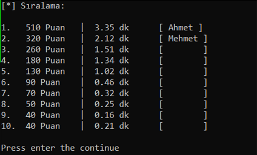

### Yılan Oyunu

- **Python** programlama dilinde **Turtle** modülü ile oluşturuldu
- Skor tablosu `sıralama.db` içerinde oluşturulan bir tabloya kaydediliyor ve `sıralama.py` ile görüntüleniyor.

- _Windows_ platformu modül kurulum için `installforwin.cmd`

---

#### - Turtle
- [bilgisayarhane.net - Yılan oyunu](http://bilgisayarhane.net/python-ogreniyorum-10-pythonda-yilan-oyunu-yapma/)
- [Introduction To Game Building With Python’s Turtle Module](https://www.edureka.co/blog/python-turtle-module/)

